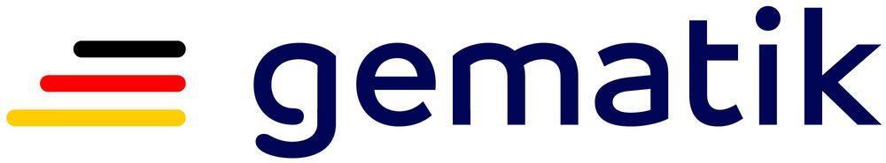

#  E-Rezept API-Dokumentation

Hier dokumentiert die gematik die Nutzung der Schnittstellen rund um das E-Rezept.

Die gematik geht neue Wege und möchte auf diesem Weg die Nutzung der Schnittstellen rund um das E-Rezept vorstellen. Die Beschreibung dieser API ergänzt die normativen Dokumente der gematik sowie die Festlegungen über die [E-Rezept-Profile](https://simplifier.net/erezept-workflow) des genutzten FHIR-Standards.

Auf den folgenden Seiten stellt die gematik die Nutzung der Schnittstellen durch die Primärsysteme der verordnenden Ärzte/Zahnärzte und der Apotheker sowie durch die E-Rezept-App vor.
Die E-Rezept-App wird durch die gematik bereitgestellt und ist zum Start des E-Rezepts in den App Stores der beiden Plattformen iOS und Android verfügbar.

In den nachfolgend verlinkten Abschnitten zeigen wir, wie sich verordnende Ärzte/Zahnärzte und Versicherte [mit der der TI verbinden](docs/authentisieren.adoc). Wir zeigen detailliert den Ablauf der [Erstellung eines E-Rezepts](docs/erp_bereitstellen.adoc) in der verordnenden Praxis und [wie Apotheker auf den Fachdienst zugreifen](docs/erp_abrufen.adoc), um ein E-Rezept zu beliefern. Für Versicherte stellen wir dar, wie die [Einsicht in die vorhandenen E-Rezepte](docs/erp_versicherte.adoc) und [Abgabeinformationen eingelöster Rezepte](docs/erp_versicherte.adoc) erfolgt, wie die [Kommunikation mit der Apotheke](docs/erp_communication.adoc) ablaufen kann und wie der Versicherte [Einsicht in das Zugriffsprotokoll](docs/erp_versicherte.adoc) auf alle seine E-Rezepte nehmen kann. Schließlich zeigen wir, wie der [Ablauf der Rezept-Einlösung](docs/erp_versicherte.adoc) für Versicherte mit dem E-Rezept funktioniert.

Die gematik veröffentlicht die Profilierung der FHIR-Ressourcen und valide Beispiele auf simplifier.net im Projekt [E-Rezept-Workflow](https://simplifier.net/erezept-workflow).

## Zugang zu Diensten der Telematikinfrastruktur

[Hier geht es zur Beschreibung des Verbindungsaufbaus zur Telematikinfrastruktur](docs/authentisieren.adoc)

## Anwendungsfälle E-Rezept in der Praxis

[Hier geht es zu den Anwendungsfällen in der (Zahn-)Arztpraxis zur Verordnung von E-Rezepten](docs/erp_bereitstellen.adoc)

## Anwendungsfälle E-Rezept in der Apotheke

[Hier geht es zu den Anwendungsfällen in der Apotheke, wie ein E-Rezept bedient wird](docs/erp_abrufen.adoc)

## Anwendungsfälle für Versicherte

[Hier geht es zu den Anwendungsfällen für Versicherte, um ihre E-Rezepte zu verwalten und einzulösen](docs/erp_versicherte.adoc)

## Anwendungsfälle für den Nachrichtenaustausch zwischen Versicherten und Apotheken

[Hier geht es zu den Anwendungsfällen für den Nachrichtenaustausch zwischen Versicherten und Apotheken](docs/erp_communication.adoc)

## Lizenzbedingungen

Copyright (c) 2021 gematik GmbH

Licensed under the Apache License, Version 2.0 (the "License");
you may not use this file except in compliance with the License.
You may obtain a copy of the License at

<http://www.apache.org/licenses/LICENSE-2.0>

Unless required by applicable law or agreed to in writing, software
distributed under the License is distributed on an "AS IS" BASIS,
WITHOUT WARRANTIES OR CONDITIONS OF ANY KIND, either express or implied.
See the License for the specific language governing permissions and
limitations under the License.
