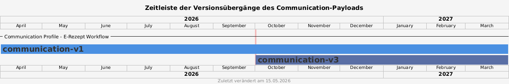

= Communication Payload Veränderungen für 01.10.2026 image:gematik_logo.png[width=150, float="right"]
// asciidoc settings for DE (German)
// ==================================
:imagesdir: ../images
:tip-caption: :bulb:
:note-caption: :information_source:
:important-caption: :heavy_exclamation_mark:
:caution-caption: :fire:
:warning-caption: :warning:
:toc: macro
:toclevels: 2
:toc-title: Inhaltsverzeichnis
:AVS: https://img.shields.io/badge/AVS-E30615
:PVS: https://img.shields.io/badge/PVS/KIS-C30059
:FdV: https://img.shields.io/badge/FdV-green
:eRp: https://img.shields.io/badge/eRp--FD-blue
:KTR: https://img.shields.io/badge/KTR-AE8E1C
:NCPeH: https://img.shields.io/badge/NCPeH-orange
:DEPR: https://img.shields.io/badge/DEPRECATED-B7410E
:bfarm: https://img.shields.io/badge/BfArM-197F71

// Variables for the Examples that are to be used
:branch: 2025-10-01

toc::[]

== Versionsübergabegänge

Ab dem 01.10.2026 unterstützt der E-Rezept-Fachdienst Version 3 des Payloads der Communication-Ressource. Da es derzeit keine Pflicht gibt, können auch PayLoads der Version 1 weiterhin übermittelt werden.

== Neue Features in Version 3
=== AVS
Version 3 des Payloads der Communication-Ressource bietet dem AVS mehr Möglichkeiten, die Belieferung von E-Rezepten besser zu unterstützen. Es kann nun den Lieferstatus, die voraussichtliche Ankunftszeit sowie die Position des Fahrzeugs in Echtzeit übermitteln. Außerdem können Informationen zu Zahlungsoptionen bereitgestellt werden. Diese sind durch das communicationType Feld gekennzeichnet.

Mehr Details sind link:./erp_communication_v3.adoc#anwendungsfall-nachricht-als-apotheke-an-einen-versicherten-schicken[hier] zu finden.

=== FdV
Version 3 des Payloads der Communication-Ressource ermöglicht es dem FdV, auf die Antwort des AVS mit Freitext zu reagieren. Dies wird durch den communicationType "text" gekennzeichnet. Die Nachricht ist dann im Feld "text" zu finden. Darüber hinaus ist es möglich, weitere Informationen vom AVS zu erhalten, wie z.B. die voraussichtliche Ankunftszeit oder den Lieferstatus, um die Kommunikation zwischen FdV und AVS zu verbessern.

== Vergleich der Payloads

Version 3 des Payloads enthält zusätzliche Felder, um die Belieferung von E-Rezepten besser zu unterstützen. Es wird empfohlen, Version 3 zu nutzen; jedoch muss Version 1 zuerst unterstützt werden, um die Kompatibilität mit verschiedenen Systemen sicherzustellen.

Eine Übersicht der Unterschiede zwischen v1 und v3 ist hier zu finden:

=== CommuncationDispReqPayload
[cols="1,1,2",options="header"]
|===
| v1
| v3
| Hinweise

| link:https://github.com/eRP-FD/erp-processing-context/blob/master/resources/production/schema/shared/json/CommunicationDispReqPayload.json[JSON-Schema]
| link:https://github.com/gematik/interactive-api-erp/blob/main/erp-fd-communications/CommunicationDispReqPayload.json[JSON-Schema]
|

| link:https://gemspec.gematik.de/docs/gemSpec/gemSpec_DM_eRp/gemSpec_DM_eRp_V1.13.0/#A_23876[Tabelle-Format]
| link:https://gemspec.gematik.de/docs/gemSpec/gemSpec_DM_eRp/latest/#A_23876-01[Tabelle-Format]
| Bitte auf Verpflichtungen und Einschränkungen achten

// --- Kernfelder ---
| version
| version
| v1: 1 +
v3: 3

| -
| communicationType
| enum(order, text)

| supplyOptionsType
| supplyOptionsType
| -

// --- Adresse / Lieferdaten ---
| name
| firstname
| maxLength ergänzt (45)

| -
| lastname
| maxLength (45)

| address
| address
| v1: Array von Strings (Beinhaltet die gesamte Adresse) +
v3: 3-100 Stellen (Beinhaltet nur Straße und Hausnummer)

| -
| postcode
| 3-10 Stellen

| -
| city
| 2-100 Stellen

| -
| country
| (ISO-Ländercode, z.B. [A-Z]{2})

| hint
| hint
| maxLength ergänzt (100)

| -
| text
| bis 800 Stellen

// --- Kontakt ---
| phone
| phone
| bis 32 Stellen

| -
| email
| RFC-konforme E-Mail-Adresse

// --- Identifikatoren ---
| -
| transactionId
| UUID
|===

=== CommuncationReplyPayload
[cols="1,1,2",options="header"]
|===
| v1
| v3
| Hinweise

| link:https://github.com/eRP-FD/erp-processing-context/blob/master/resources/production/schema/shared/json/CommunicationReplyPayload.json[JSON-Schema]
| link:https://github.com/gematik/interactive-api-erp/blob/main/erp-fd-communications/CommunicationReplyPayload.json[JSON-Schema]
|

| link:https://gemspec.gematik.de/docs/gemSpec/gemSpec_DM_eRp/gemSpec_DM_eRp_V1.13.0/#A_23877[Tabelle-Format]
| link:https://gemspec.gematik.de/docs/gemSpec/gemSpec_DM_eRp/latest/#A_23877-01[Tabelle-Format]
| Bitte auf Verpflichtungen und Einschränkungen achten

// --- Kernfelder ---
| version
| version
| v1: 1 +
v3: 3

| -
| communicationType
| enum(text, link, reservationStatus, pickupCodeHR, pickupCodeDMC, deliveryStatus, paymentInfo)

| supplyOptionsType
| -
| Wird durch communicationType ersetzt

| info_text
| text
| Umbenannt und auf 800 Stellen erweitert

| url
| url
| -

| -
| transactionID
| UUID

| -
| readyForCollection
| enum(immediately, sameDay, nextDay, nextDayAM, nextDayPM, unknown, notAvailable)

| -
| deliveryStatus
| enum(preparedWaiting, inTransport, delivered, incident)

| -
| inTransportPosition
| Lat, Long - Beispiel: +
{"long": 13.387595793605172, "lat": 52.522529939635795}

| -
| inTransportETA
| TIMESTAMP-TIMESTAMP - Beispiel: +
{"from": 1735736400, "to": 1735741800}

| -
| totalAmount
| Nummerische Betrag in Eurocent - Beispiel: 12550

| -
| paymentMethods
| Array aus Objekts (siehe JSON-Schema)

| pickUpCodeHR
| pickupCodeHR
| Umbenannt (pickup statt pickUp)

| pickUpCodeDMC
| pickupCodeDMC
| Umbenannt (pickup statt pickUp)

|===
