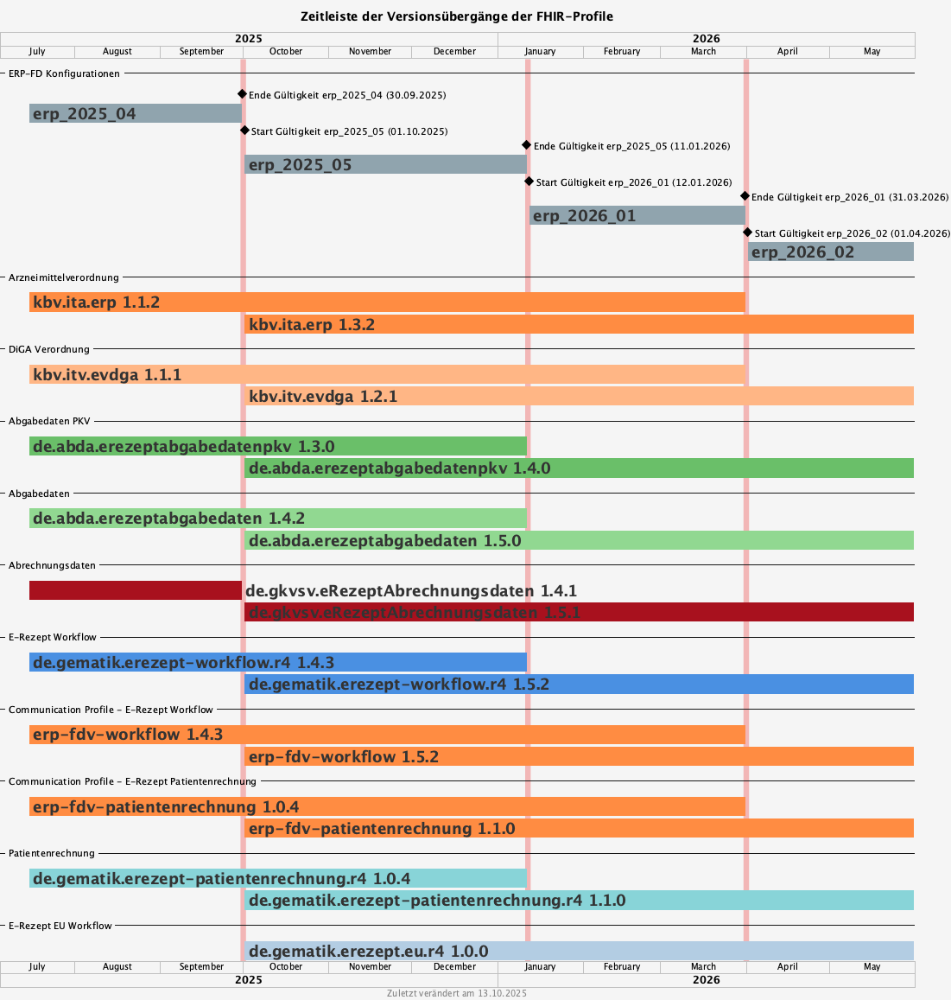

= E-Rezept FHIR Veränderungen für 01.10.2025 image:gematik_logo.png[width=150, float="right"]
// asciidoc settings for DE (German)
// ==================================
:imagesdir: ../images
:tip-caption: :bulb:
:note-caption: :information_source:
:important-caption: :heavy_exclamation_mark:
:caution-caption: :fire:
:warning-caption: :warning:
:toc: macro
:toclevels: 2
:toc-title: Inhaltsverzeichnis
:AVS: https://img.shields.io/badge/AVS-E30615
:PVS: https://img.shields.io/badge/PVS/KIS-C30059
:FdV: https://img.shields.io/badge/FdV-green
:eRp: https://img.shields.io/badge/eRp--FD-blue
:KTR: https://img.shields.io/badge/KTR-AE8E1C
:NCPeH: https://img.shields.io/badge/NCPeH-orange
:DEPR: https://img.shields.io/badge/DEPRECATED-B7410E
:bfarm: https://img.shields.io/badge/BfArM-197F71

// Variables for the Examples that are to be used
:branch: 2025-10-01

toc::[]

Die FHIR Profiländerungen beinhalten keine fachlichen Erweiterungen oder neue Features. Die Profilanpassungen enthalten Fehlerbehebungen, bessere Validierung, sowie die Anpassung aller Profilabhängigkeiten auf das DE-Basisprofil in Version 1.5.x. Damit wird der PKV-Identifier nicht mehr unterstützt.

== Versionsübergabegänge

Der anstehende FHIR-Profilübergang stellt sich wie folgt dar:

Die zugrundeliegende Konfiguration findet sich hier: link:../resources/configuration/2025-10-01_fhir-transition.json[Konfiguration für den Übergang zum 01.10.2025]

=== Package Gültigkeiten

Die Gültigkeiten von FHIR Packages in diesem Übergang stellen sich wie folgt dar:

[cols="h,a,a,a"]
|===
|*FHIR Paket* |*Version* |*Gültig Von* |*Gültig Bis*

|de.abda.erezeptabgabedaten |1.4.2 |- |11.01.2026
|de.abda.erezeptabgabedaten |1.5.0 |01.10.2025 |-
|de.abda.erezeptabgabedatenpkv |1.3.0 |- |11.01.2026
|de.abda.erezeptabgabedatenpkv |1.4.0 |01.10.2025 |-
|de.gematik.erezept-patientenrechnung.r4 |1.0.4 |- |11.01.2026
|de.gematik.erezept-patientenrechnung.r4 |1.1.0 |01.10.2025 |-
|de.gematik.erezept-workflow.r4 |1.4.3 |- |11.01.2026
|de.gematik.erezept-workflow.r4 |1.5.2 |01.10.2025 |-
|de.gematik.erezept.eu.r4 |1.0.0 |01.10.2025 |-
|de.gkvsv.eRezeptAbrechnungsdaten |1.4.1 |- |30.09.2025
|de.gkvsv.eRezeptAbrechnungsdaten |1.5.1 |01.10.2025 |-
|erp-communications-patientenrechnung |1.0.4 |- |31.03.2026
|erp-communications-patientenrechnung |1.1.0 |01.10.2025 |-
|erp-communications-workflow |1.4.3 |- |31.03.2026
|erp-communications-workflow |1.5.2 |01.10.2025 |-
|kbv.ita.erp |1.1.2 |- |31.03.2026
|kbv.ita.erp |1.3.2 |01.10.2025 |-
|kbv.itv.evdga |1.1.1 |- |31.03.2026
|kbv.itv.evdga |1.2.1 |01.10.2025 |-
|===

Die Profile für die Angaben _erp-communications-workflow_ und _erp-communications-patientenrechnung_ entsprechen den Communication Profilen aus den Packages:
[options="header"]
|===
| Profilname | aus Package | Bestandteil von
| GEM_ERP_PR_Communication_Representative | de.gematik.erezept-workflow.r4 | erp-communications-workflow
| GEM_ERP_PR_Communication_DispReq | de.gematik.erezept-workflow.r4 | erp-communications-workflow
| GEM_ERPCHRG_PR_PAR_Patch_ChargeItem_Input | de.gematik.erezept-patientenrechnung.r4 | erp-communications-patientenrechnung
| GEM_ERPCHRG_PR_Communication_ChargChangeReq | de.gematik.erezept-patientenrechnung.r4 | erp-communications-patientenrechnung
|===

== Änderungen

=== Übersicht
[cols="a,a,a,a"]
[%autowidth]
|===
h|Betrifft h|Feature h|Ressource h|Änderungen

| *Alle* | *Allgemein* | Alle | Anpassen der Versionsangabe in meta.profile von '\|1.Y' zu '\|1.X'.

In allen Ressourcen wird die Versionsangabe in meta.profile zweistellig angegeben. Bsp: '\|1.2' statt '\|1.2.2'

| *Alle* | *Allgemein* | Alle | Hochziehen der Basisprofil Version (de.basisprofile.r4) auf 1.5.2. Der PKV- und GKV-Identifier wurde in den deutschen Basisprofilen mit folgendem .system vereinheitlicht: *\http://fhir.de/sid/gkv/kvid-10*

| image:{NCPeH}[] image:{FdV}[] | *Einlösen im EU Ausland*| link:https://simplifier.net/erezept-workflow-eu[Workflow-EU] | Umsetzung der Anwendungsfälle für das link:./erp_eprescription.adoc[Einlösen von E-Rezepten im EU Ausland].

| image:{KTR}[] image:{FdV}[] | *DiGA* | link:https://simplifier.net/erezept-workflow[Workflow] | Neues Profil Communication_DiGA, s. Anwendungsfall link:./erp_diga.adoc#nachricht-als-kostenträger-an-einen-versicherten-schicken[Nachricht als Kostenträger an einen Versicherten schicken]

| image:{FdV}[] |link:erp_chargeItem.adoc#anwendungsfall-abrechnungsinformationen-durch-den-versicherten-ändern[Anwendungsfall Abrechnungsinformationen durch den Versicherten ändern]| link:https://simplifier.net/erezept-patientenrechnung/gem_erpchrg_pr_par_patch_chargeitem_input[GEM_ERPCHRG_PR_PAR_Patch_ChargeItem_Input] | Neues Profil für den Endpunkt PATCH /ChargeItem

| image:{FdV}[] image:{AVS}[] | *Belieferungsanfrage* | link:https://simplifier.net/erezept-workflow/gem_erp_pr_communication_dispreq[GEM_ERP_PR_Communication_InfoReq] | Constraint for GEM_ERP_PR_Communication_InfoReq wurde als `retired` markiert. Der Anwendungsfall ist aktuell nicht umzusetzen.

| image:{AVS}[] | *Abgabe auf Abrechnungsstrecke* | link:https://simplifier.net/erezeptabgabedatenbasis/dav_ex_erp_rezeptaenderung[DAV_EX_ERP_Rezeptaenderung] | Hinzufügen des Constraint "EX-DatumRezeptaenderung" in Extension-DAV-EX-ERP-Rezeptaenderung - Extension.extension:DatumRezeptaenderung.valueDate (YYYY-MM-DD) +

| image:{AVS}[] | *Abrechnungsdaten* | link:https://simplifier.net/erezeptabrechnungsdaten/gkvsv_pr_erp_eabrechnungsdaten[GKVSV_PR_ERP_eAbrechnungsdaten] |
Constraint line-item-seq hinzugefügt

Bundle.entry:Quittungsdaten.link.url Änderung

https://gematik.de/fhir/StructureDefinition/ErxReceipt zu https://gematik.de/fhir/erp/StructureDefinition/GEM_ERP_PR_Bundle

| image:{PVS}[] | *Verordnung* | Allgemein |
Verbesserung von Constraints und fachlichen Prüfungen

Sonstige Kostenträger sind erlaubt. (Neue Nutzergruppe: Bundespolizei)

| image:{PVS}[] | *Verordnung* | link:https://simplifier.net/erezept/kbv_pr_erp_prescription[KBV_PR_ERP_Prescription] | Ersetzen der Extension KBV_EX_ERP_BVG durch KBV_EX_FOR_SER.

| image:{PVS}[] | *Verordnung* | link:https://simplifier.net/erezept/kbv_pr_erp_prescription[KBV_PR_ERP_Prescription] link:https://simplifier.net/erezept/kbv_ex_erp_prescriber_id[KBV_EX_ERP_PRESCRIBER_ID] | Hinzufügen der Verschreiber ID, welche bei der Verordnung bestimmter Präparate (bspw. Fintepla®) anzugeben ist, damit die Apotheke das Rezept beliefern darf.

| image:{PVS}[] | *Verordnung* | link:https://simplifier.net/erezept/kbv_pr_erp_medication_pzn[KBV_PR_ERP_Medication_PZN] |
Möglichkeit zur Angabe des Wirkstoffs in einer PZN-Verordnung

Anpassung der Constraints zur Packungsgröße

| image:{PVS}[] | *Verordnung* | link:https://simplifier.net/erezept/kbv_pr_erp_medication_pzn[KBV_PR_ERP_Medication_PZN], link:https://simplifier.net/erezept/kbv_pr_erp_medication_ingredient[KBV_PR_ERP_Medication_Ingredient] |
Die Wirstärke von Wirkstoffen bei PZN- und Wirkstoffverordnungen werden mit Numerator **und** Denominator angegeben. Es muss jeweils beides angegeben werden (z.B. 400mg / 1 Tablette). Die Einheiten werden als Freitext angegeben.

|===

=== Release Notes der FHIR Packages
Weiterhin sind die Releasenotes der FHIR-Packages zu beachten:

[cols="a,a,a"]
[%autowidth]
|===
h| Herausgeber h|FHIR Package h| Beispiele
| gematik |  link:https://simplifier.net/packages/de.gematik.erezept-workflow.r4/1.5.1[de.gematik.erezept-workflow.r4 Package 1.5.1^]  | link:https://github.com/gematik/eRezept-Examples/tree/main/Standalone-Examples/de.gematik.erezept-workflow.r4/1.5.1[Beispiele 1.5.1^]
| gematik |  link:https://simplifier.net/packages/de.gematik.erezept-patientenrechnung.r4/1.1.0[de.gematik.erezept-patientenrechnung.r4 Package 1.1.0^] | link:https://github.com/gematik/eRezept-Examples/tree/main/Standalone-Examples/de.gematik.erezept-patientenrechnung.r4/1.1.0[Beispiele 1.1.0]
| gematik |  link:https://simplifier.net/packages/de.gematik.erezept.eu/1.0.0[de.gematik.erezept.eu Package 1.0.0^]  | link:https://github.com/gematik/eRezept-Examples/tree/main/Standalone-Examples/de.gematik.erezept.eu/1.0.0[TODO]
| DAV |  link:https://simplifier.net/packages/de.abda.erezeptabgabedaten/1.5.0[de.abda.eRezeptAbgabedaten Package 1.5.0^] | link:https://github.com/gematik/eRezept-Examples/tree/main/Standalone-Examples/de.abda.eRezeptAbgabedaten/1.5.0[Beispiele 1.5.0]
| DAV |  link:https://simplifier.net/packages/de.abda.erezeptabgabedatenpkv/1.4.0[de.abda.eRezeptAbgabedatenPKV Package 1.4.0^] | link:https://github.com/gematik/eRezept-Examples/tree/main/Standalone-Examples/de.abda.eRezeptAbgabedatenPKV/1.4.0[Beispiele 1.4.0]
| KBV |  link:https://simplifier.net/packages/kbv.ita.erp/1.3.2[kbv.ita.erp Package 1.3.2^] | link:https://github.com/gematik/eRezept-Examples/tree/main/Standalone-Examples/kbv.ita.erp/1.3.2[Beispiele 1.3.2]
| KBV |  link:https://simplifier.net/packages/kbv.itv.evdga/1.2.1[kbv.itv.evdga Package 1.2.1^] | link:https://github.com/gematik/eRezept-Examples/tree/main/Standalone-Examples/kbv.itv.evdga/1.2.1[Beispiele 1.2.1]
| GKV-SV | link:https://simplifier.net/packages/de.gkvsv.eRezeptAbrechnungsdaten/1.5.0[de.gkvsv.eRezeptAbrechnungsdaten Package 1.5.0^] | n/a
|===
