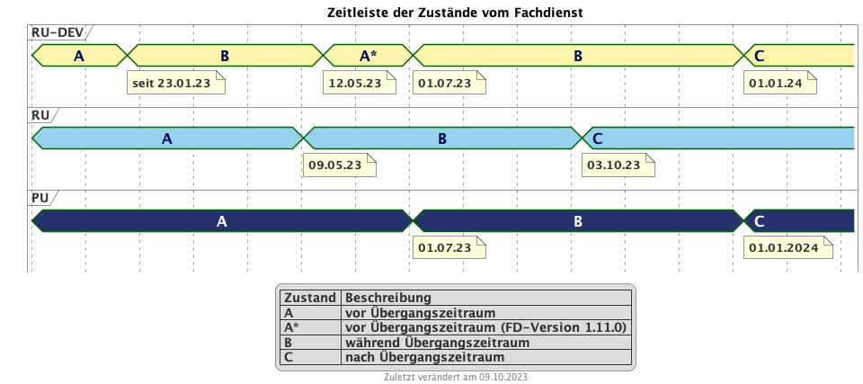

Auf dieser Seite sind relevante Informationen zum Verhalten des
Fachdienstes während und nach der Übergangszeit aufgeführt. Dieser
Übergangszeitraum wird nach der [Technischen Anlage der
KBV](https://update.kbv.de/ita-update/DigitaleMuster/ERP/III_2023/KBV_ITA_VGEX_Technische_Anlage_ERP.pdf)
(KP36-04) **6 Monate** betragen. Gilt also somit vom 01.07.2023 bis
31.12.2023.

# Zustände des Fachdienstes im Zusammenhang mit dem Übergangszeitraum

Diese Darstellung zeigt die Konfigurationen der Umgebungen des
Fachdienstes zu gegebener Zeit auf. Es ist dargestellt, welche
Profilversionen vom Fachdienst akzeptiert werden. Die Konfigurationen
und Beschreibung sind der Legende zu entnehmen.

# Übersicht Schnittstelle und Antwort

## Methodik

Im Folgenden ist eine Übersicht dargestellt, wie sich der Fachdienst zu
gegebener Zeit verhält und welche Ressourcen als Antwort gegeben werden.
Hierbei gibt es zwei zu betrachtende Zeiträume in der PU: \*
**Übergangszeitraum** (01.07. - 31.12.2023) \* **Nach dem
Übergangszeitraum** (ab 01.01.2024)

Die zu unterscheidenden Profilversionen sind wie folgt bezeichnet: \*
FHIR 2022: bis 30.06.2023 gültige Profilversionen \* FHIR 2023: ab
01.07.2023 gültige Profilversionen

Der Fachdienst wird ab 01.07. so konfiguriert, dass Verordnungen mit dem
Workflowtype 200 oder 209 (PKV Verordnungen), die mit einer KBV
Verordnung der Version 1.0.2 erstellt wurden, abgewiesen werden.

### Übersicht der FHIR-Profile

<table>
<colgroup>
<col style="width: 33%" />
<col style="width: 33%" />
<col style="width: 33%" />
</colgroup>
<tbody>
<tr class="odd">
<td style="text-align: left;">
<strong>Projekt</strong>
</td>
<td style="text-align: left;">
FHIR 2022
</td>
<td style="text-align: left;">
FHIR 2023
</td>
</tr>
<tr class="even">
<td style="text-align: left;">
<strong>gematik E-Rezept
Workflow</strong>
</td>
<td style="text-align: left;">
<a
href="https://simplifier.net/packages/de.gematik.erezept-workflow.r4/1.1.0">https://simplifier.net/packages/de.gematik.erezept-workflow.r4/1.1.0</a>
</td>
<td style="text-align: left;">
<a
href="https://simplifier.net/packages/de.gematik.erezept-workflow.r4/1.2.1">https://simplifier.net/packages/de.gematik.erezept-workflow.r4/1.2.1</a>
</td>
</tr>
<tr class="odd">
<td style="text-align: left;">
<strong>gematik E-Rezept
Abrechnungsinformation</strong>
</td>
<td style="text-align: left;">
n/a
</td>
<td style="text-align: left;">
<a
href="https://simplifier.net/packages/de.gematik.erezept-patientenrechnung.r4/1.0.1">https://simplifier.net/packages/de.gematik.erezept-patientenrechnung.r4/1.0.1</a>
</td>
</tr>
<tr class="even">
<td style="text-align: left;">
<strong>KBV eRezept</strong>
</td>
<td style="text-align: left;">
<a
href="https://simplifier.net/packages/kbv.ita.erp/1.0.2">https://simplifier.net/packages/kbv.ita.erp/1.0.2</a>
</td>
<td style="text-align: left;">
<a
href="https://simplifier.net/packages/kbv.ita.erp/1.1.1">https://simplifier.net/packages/kbv.ita.erp/1.1.1</a>
</td>
</tr>
<tr class="odd">
<td style="text-align: left;">
<strong>ABDA
eRezeptAbgabedaten</strong>
</td>
<td style="text-align: left;">
n/a
</td>
<td style="text-align: left;">
<a
href="https://simplifier.net/packages/de.abda.erezeptabgabedatenpkv/1.1.0">https://simplifier.net/packages/de.abda.erezeptabgabedatenpkv/1.1.0</a>
</td>
</tr>
</tbody>
</table>

## Wichtige Bemerkungen

-   Ab Konfiguration "B" antwortet der Fachdienst immer mit den neuen
    Profilversionen von Task, AuditEvent, ChargeItems, Consent, auch
    wenn diese auf alte Profile verweisen

-   Die letzten KBV Bundle und Medication Ressourcen werden den
    Fachdienst rechnerisch nach dem 09.04.2025 verlassen

-   Eine MVO-Verordnung, die am 31.12.2023 eingestellt wird kann, falls
    kein expliziter Gültigkeitszeitraum angegeben wurde, bis zum
    30.12.2024 eingelöst und verarbeitet werden

## Daten

<table>
<colgroup>
<col style="width: 25%" />
<col style="width: 25%" />
<col style="width: 25%" />
<col style="width: 25%" />
</colgroup>
<tbody>
<tr class="odd">
<td style="text-align: left;">
<strong>Operation</strong>
</td>
<td style="text-align: left;">
Schnittstelle zu
</td>
<td style="text-align: left;">
Während Übergangszeit
</td>
<td style="text-align: left;">
Nach Übergangszeit
</td>
</tr>
<tr class="even">
<td style="text-align: left;">
<strong>GET /Device</strong>
</td>
<td style="text-align: left;">
all
</td>
<td style="text-align: left;">
Request

<ul>
<li>
n/a
</li>
</ul>

Response

<ul>
<li>
FD antwortet immer mit FHIR 2023
</li>
</ul></td>
<td style="text-align: left;">
Request

<ul>
<li>
n/a
</li>
</ul>

Response

<ul>
<li>
FD antwortet immer mit FHIR 2023
</li>
</ul></td>
</tr>
<tr class="odd">
<td style="text-align: left;">
<strong>GET/metadata</strong>
</td>
<td style="text-align: left;">
all
</td>
<td style="text-align: left;">
Request

<ul>
<li>
n/a
</li>
</ul>

Response

<ul>
<li>
FD antwortet immer mit FHIR 2023
</li>
</ul></td>
<td style="text-align: left;">
Request

<ul>
<li>
n/a
</li>
</ul>

Response

<ul>
<li>
FD antwortet immer mit FHIR 2023
</li>
</ul></td>
</tr>
<tr class="even">
<td style="text-align: left;">
<strong>POST
/Task/$create</strong>
</td>
<td style="text-align: left;">
verordnende LEI
</td>
<td style="text-align: left;">
Request

<ul>
<li>
Akzeptiert wird eine &lt;Parameters&gt; FHIR Resource gemäß FHIR
2022 Namespace
</li>
<li>
Akzeptiert wird eine &lt;Parameters&gt; FHIR Resource gemäß FHIR
2023 Namespace
</li>
</ul>

Response

<ul>
<li>
FD antwortet mit einem Task gemäß FHIR 2023
</li>
</ul></td>
<td style="text-align: left;">
Request

<ul>
<li>
Akzeptiert wird eine &lt;Parameters&gt; FHIR Resource gemäß FHIR
2023 Namespace
</li>
</ul>

Response

<ul>
<li>
FD antwortet mit einem Task gemäß FHIR 2023
</li>
</ul></td>
</tr>
<tr class="odd">
<td style="text-align: left;">
<strong>POST
/Task/&lt;id&gt;/$activate</strong>
</td>
<td style="text-align: left;">
verordnende LEI
</td>
<td style="text-align: left;">
Request

Workflow 160/169 (GKV):

<ul>
<li>
Akzeptiert wird ein 2022 KBV Bundle
</li>
<li>
Akzeptiert wird ein 2023 KBV Bundle
</li>
</ul>

Workflow 200/209 (PKV):

<ul>
<li>
Akzeptiert wird ein 2023 KBV Bundle
</li>
</ul>

Response

<ul>
<li>
FD antwortet mit einem Task gemäß FHIR 2023
</li>
</ul></td>
<td style="text-align: left;">
Request

<ul>
<li>
Akzeptiert wird ein 2023 KBV Bundle
</li>
</ul>

Response

<ul>
<li>
FD antwortet mit einem Task gemäß FHIR 2023
</li>
</ul></td>
</tr>
<tr class="even">
<td style="text-align: left;">
<strong>POST
/Task/&lt;id&gt;/$abort</strong>
</td>
<td style="text-align: left;">
verordnende LEI
</td>
<td style="text-align: left;">
Request

<ul>
<li>
n/a
</li>
</ul>

Response

<ul>
<li>
n/a - no content
</li>
</ul></td>
<td style="text-align: left;">
Request

<ul>
<li>
n/a
</li>
</ul>

Response

<ul>
<li>
n/a - no content
</li>
</ul></td>
</tr>
<tr class="odd">
<td style="text-align: left;">
<strong>GET /Task</strong>
</td>
<td style="text-align: left;">
Versicherte
</td>
<td style="text-align: left;">
Request

<ul>
<li>
n/a
</li>
</ul>

Response

<ul>
<li>
Bundle of Tasks gemäß FHIR 2023
</li>
</ul></td>
<td style="text-align: left;">
Request

<ul>
<li>
n/a
</li>
</ul>

Response

<ul>
<li>
Bundle of Tasks gemäß FHIR 2023
</li>
</ul></td>
</tr>
<tr class="even">
<td style="text-align: left;">
<strong>POST
/Task/&lt;id&gt;/$abort</strong>
</td>
<td style="text-align: left;">
Versicherte
</td>
<td style="text-align: left;">
Request

<ul>
<li>
n/a
</li>
</ul>

Response

<ul>
<li>
n/a - no content
</li>
</ul></td>
<td style="text-align: left;">
Request

<ul>
<li>
n/a
</li>
</ul>

Response

<ul>
<li>
n/a - no content
</li>
</ul></td>
</tr>
<tr class="odd">
<td style="text-align: left;">
<strong>POST
/Communication</strong>
</td>
<td style="text-align: left;">
Versicherte
</td>
<td style="text-align: left;">
Request

DispReq

<ul>
<li>
2022 FHIR Communication
</li>
<li>
2023 FHIR Communication
</li>
</ul>

InfoReq

<ul>
<li>
Implementierung in der App erfolgt Q3/Q4 2023
</li>
<li>
2023 FHIR Communication mit 2022 KBV Medication
</li>
<li>
2023 FHIR Communication mit 2023 KBV Medication
</li>
</ul>

Response

<ul>
<li>
Der FD antwortet mit der Communication mit den Profilversionen,
wie sie eingestellt wurde
</li>
</ul></td>
<td style="text-align: left;">
Der ERP-FD müsste zumindest die "2022
KBV Medication" akzeptieren, bis diese abgelaufen sind. Das kann bei MVO
1 Jahr + &lt;Dauer Übergangszeit&gt; nach Gültigkeit der Fall sein.

Request

DispReq

<ul>
<li>
2023 FHIR Communication
</li>
</ul>

InfoReq

<ul>
<li>
Implementierung erfolgt in der App voraussichtlich Q3/Q4
2023
</li>
<li>
2023 FHIR Communication mit 2022 KBV Medication

<ul>
<li>
bis 30.12.2024
</li>
<li>
ergibt sich aus: Ende Übergangszeitraum + 1 Jahr (MVO)
</li>
</ul></li>
<li>
2023 FHIR Communication mit 2023 KBV Medication
</li>
</ul>

Response

<ul>
<li>
Der FD antwortet mit der Communication mit den Profilversionen,
wie sie eingestellt wurde
</li>
</ul></td>
</tr>
<tr class="even">
<td style="text-align: left;">
<strong>GET
/Communication</strong>
</td>
<td style="text-align: left;">
Versicherte
</td>
<td style="text-align: left;">
Request

<ul>
<li>
n/a
</li>
</ul>

Response

DispReq

<ul>
<li>
2022 FHIR Communication
</li>
<li>
2023 FHIR Communication
</li>
</ul>

InfoReq

<ul>
<li>
Implementierung in der App erfolgt Q3/Q4 2023
</li>
<li>
2023 FHIR Communication mit 2022 KBV_Medication
</li>
<li>
2023 FHIR Communication mit 2023 KBV_Medication
</li>
</ul>

Communication_Reply

<ul>
<li>
2022 FHIR Communication
</li>
<li>
2023 FHIR Communication
</li>
</ul>

Der FD antwortet mit der Communication mit den Profilversionen, wie
sie eingestellt wurden.
</td>
<td style="text-align: left;">
Request

<ul>
<li>
n/a
</li>
</ul>

Response

DispReq

<ul>
<li>
2023 FHIR Communication
</li>
</ul>

InfoReq

<ul>
<li>
Implementierung in der App erfolgt Q3/Q4 2023
</li>
<li>
2023 FHIR Communication mit 2022 KBV_Medication
</li>
<li>
2023 FHIR Communication mit 2023 KBV_Medication
</li>
</ul>

Communication_Reply

<ul>
<li>
2023 FHIR Communication
</li>
</ul>

Der FD antwortet mit der Communication mit den Profilversionen, wie
sie eingestellt wurden.
</td>
</tr>
<tr class="odd">
<td style="text-align: left;">
<strong>GET
/AuditEvent</strong>
</td>
<td style="text-align: left;">
Versicherte
</td>
<td style="text-align: left;">
Request

<ul>
<li>
n/a
</li>
</ul>

Response

<ul>
<li>
Bundle of AuditEvents gemäß FHIR 2023
</li>
</ul></td>
<td style="text-align: left;">
Request

<ul>
<li>
n/a
</li>
</ul>

Response

<ul>
<li>
Bundle of AuditEvents gemäß FHIR 2023
</li>
</ul></td>
</tr>
<tr class="even">
<td style="text-align: left;">
<strong>GET
/Task/&lt;id&gt;</strong>
</td>
<td style="text-align: left;">
Versicherte
</td>
<td style="text-align: left;">
Request

<ul>
<li>
n/a
</li>
</ul>

Response

Der FD antwortet mit einem Bundle bestehend aus Task und KBV
Bundle

<ul>
<li>
Task gemäß FHIR 2023 Profil
</li>
<li>
KBV Bundle 2022 FHIR oder KBV Bundle 2023 FHIR
</li>
</ul></td>
<td style="text-align: left;">
Request

<ul>
<li>
n/a
</li>
</ul>

Response

Der FD antwortet mit einem Bundle bestehend aus Task und KBV
Bundle

<ul>
<li>
Task gemäß FHIR 2023 Profil mit

<ul>
<li>
KBV Bundle 2022 FHIR

<ul>
<li>
bis 09.04.2025
</li>
<li>
ergibt sich aus: Ende Übergangszeitraum + MVO (1 Jahr) +
Löschfrist (100 Tage)
</li>
</ul></li>
<li>
oder KBV Bundle 2023 FHIR
</li>
</ul></li>
</ul></td>
</tr>
<tr class="odd">
<td style="text-align: left;">
<strong>GET
/ChargeItem/&lt;id&gt;</strong>
</td>
<td style="text-align: left;">
Versicherte
</td>
<td style="text-align: left;">
pkv
</td>
<td style="text-align: left;">
pkv
</td>
</tr>
<tr class="even">
<td style="text-align: left;">
<strong>DELETE
/Communication/&lt;id&gt;</strong>
</td>
<td style="text-align: left;">
Versicherte
</td>
<td style="text-align: left;">
Request

<ul>
<li>
n/a
</li>
</ul>

Response

<ul>
<li>
n/a
</li>
</ul></td>
<td style="text-align: left;">
Request

<ul>
<li>
n/a
</li>
</ul>

Response

<ul>
<li>
n/a
</li>
</ul></td>
</tr>
<tr class="odd">
<td style="text-align: left;">
<strong>GET
/MedicationDispense</strong>
</td>
<td style="text-align: left;">
Versicherte
</td>
<td style="text-align: left;">
Request

<ul>
<li>
akzeptiert PrescriptionId gemäß

<ul>
<li>
2022 Namespace
</li>
<li>
2023 Namespace
</li>
</ul></li>
</ul>

Response

<ul>
<li>
Bundle von MedicationDispenses (wie vom AVS eingestellt)

<ul>
<li>
MedicationDispense 2022 mit 2022 KBV_Medication
</li>
<li>
MedicationDispense 2022 mit 2023 KBV_Medication
</li>
<li>
MedicationDispense 2023 mit 2022 KBV_Medication
</li>
<li>
MedicationDispense 2023 mit 2023 KBV_Medication
</li>
</ul></li>
</ul></td>
<td style="text-align: left;">
Request

<ul>
<li>
akzeptiert PrescriptionId gemäß

<ul>
<li>
2022 Namespace (bis 01.07.2024)
</li>
<li>
2023 Namespace
</li>
</ul></li>
</ul>

Response

<ul>
<li>
Bundle von MedicationDispenses (wie vom AVS eingestellt)

<ul>
<li>
MedicationDispense 2023 mit 2022 KBV_Medication

<ul>
<li>
bis 30.01.2025
</li>
<li>
ergibt sich aus: Ende Übergangszeitraum + MVO (1 Jahr) +
Einlösezeit der Apotheken (1 Monat)
</li>
</ul></li>
<li>
MedicationDispense 2023 mit 2023 KBV_Medication
</li>
</ul></li>
</ul></td>
</tr>
<tr class="even">
<td style="text-align: left;">
<strong>GET
/ChargeItem</strong>
</td>
<td style="text-align: left;">
Versicherte
</td>
<td style="text-align: left;">
pkv
</td>
<td style="text-align: left;">
pkv
</td>
</tr>
<tr class="odd">
<td style="text-align: left;">
<strong>DELETE
/ChargeItem/&lt;id&gt;</strong>
</td>
<td style="text-align: left;">
Versicherte
</td>
<td style="text-align: left;">
pkv
</td>
<td style="text-align: left;">
pkv
</td>
</tr>
<tr class="even">
<td style="text-align: left;">
<strong>PATCH
/ChargeItem/&lt;id&gt;</strong>
</td>
<td style="text-align: left;">
Versicherte
</td>
<td style="text-align: left;">
pkv
</td>
<td style="text-align: left;">
pkv
</td>
</tr>
<tr class="odd">
<td style="text-align: left;">
<strong>GET /Consent</strong>
</td>
<td style="text-align: left;">
Versicherte
</td>
<td style="text-align: left;">
pkv
</td>
<td style="text-align: left;">
pkv
</td>
</tr>
<tr class="even">
<td style="text-align: left;">
<strong>POST /Consent</strong>
</td>
<td style="text-align: left;">
Versicherte
</td>
<td style="text-align: left;">
pkv
</td>
<td style="text-align: left;">
pkv
</td>
</tr>
<tr class="odd">
<td style="text-align: left;">
<strong>DELETE
/Consent</strong>
</td>
<td style="text-align: left;">
Versicherte
</td>
<td style="text-align: left;">
pkv
</td>
<td style="text-align: left;">
pkv
</td>
</tr>
<tr class="even">
<td style="text-align: left;">
<strong>POST
/Task/&lt;id&gt;/$accept</strong>
</td>
<td style="text-align: left;">
abgebende LEI
</td>
<td style="text-align: left;">
Request

<ul>
<li>
n/a
</li>
</ul>

Response

&lt;Bundle&gt; mit Tasks und PKCS7 Datei mit Verordnung

<ul>
<li>
Task gemäß FHIR 2023
</li>
<li>
KBV Bundle FHIR 2022 oder FHIR 2023
</li>
</ul></td>
<td style="text-align: left;">
Request

<ul>
<li>
n/a
</li>
</ul>

Response

&lt;Bundle&gt; mit Tasks und PKCS7 Datei mit Verordnung

<ul>
<li>
Task gemäß FHIR 2023
</li>
<li>
Die Verordnung ist wie vom Arzt eingestellt

<ul>
<li>
KBV Bundle FHIR 2022

<ul>
<li>
bis 30.12.2024
</li>
<li>
ergibt sich aus: Ende Übergangszeitraum + MVO (1 Jahr)
</li>
</ul></li>
<li>
KBV Bundle FHIR 2023
</li>
</ul></li>
</ul></td>
</tr>
<tr class="odd">
<td style="text-align: left;">
<strong>POST
/Task/&lt;id&gt;/$reject</strong>
</td>
<td style="text-align: left;">
abgebende LEI
</td>
<td style="text-align: left;">
Request

<ul>
<li>
n/a
</li>
</ul>

Response

<ul>
<li>
n/a - no content
</li>
</ul></td>
<td style="text-align: left;">
Request

<ul>
<li>
n/a
</li>
</ul>

Response

<ul>
<li>
n/a - no content
</li>
</ul></td>
</tr>
<tr class="even">
<td style="text-align: left;">
<strong>POST
/Task/&lt;id&gt;/$abort</strong>
</td>
<td style="text-align: left;">
abgebende LEI
</td>
<td style="text-align: left;">
Request

<ul>
<li>
n/a
</li>
</ul>

Response

<ul>
<li>
n/a - no content
</li>
</ul></td>
<td style="text-align: left;">
Request

<ul>
<li>
n/a
</li>
</ul>

Response

<ul>
<li>
n/a - no content
</li>
</ul></td>
</tr>
<tr class="odd">
<td style="text-align: left;">
<strong>POST
/Task/&lt;id&gt;/$close</strong>
</td>
<td style="text-align: left;">
abgebende LEI
</td>
<td style="text-align: left;">
Request

<ul>
<li>
&lt;MedicationDispense&gt; bzw. Bundle von MedicationDispense -
FHIR 2023

<ul>
<li>
enthält 2022 KBV Medication
</li>
<li>
enthält 2023 KBV Medication
</li>
</ul></li>
</ul>

Response

<ul>
<li>
&lt;Bundle&gt; mit PKCS7 mit Quittung - FHIR 2023
</li>
</ul></td>
<td style="text-align: left;">
Request

<ul>
<li>
&lt;MedicationDispense&gt; bzw. Bundle von MedicationDispense -
FHIR 2023

<ul>
<li>
enthält 2022 KBV Medication

<ul>
<li>
bis 09.04.2025
</li>
<li>
ergibt sich aus: Ende Übergangszeitraum + MVO (1 Jahr) +
Löschfrist (100 Tage)
</li>
</ul></li>
<li>
enthält 2023 KBV Medication
</li>
</ul></li>
</ul>

Response

<ul>
<li>
&lt;Bundle&gt; mit PKCS7 mit Quittung - FHIR 2023
</li>
</ul></td>
</tr>
<tr class="even">
<td style="text-align: left;">
<strong>POST
/Communication</strong>
</td>
<td style="text-align: left;">
abgebende LEI
</td>
<td style="text-align: left;">
Request

<ul>
<li>
2022 FHIR Communication
</li>
<li>
2023 FHIR Communication
</li>
</ul>

Response

<ul>
<li>
Der FD antwortet mit der Communication mit den Profilversionen,
wie sie eingestellt wurde
</li>
</ul></td>
<td style="text-align: left;">
Request

<ul>
<li>
2023 FHIR Communication
</li>
</ul>

Response

<ul>
<li>
Der FD antwortet mit der Communication mit den Profilversionen,
wie sie eingestellt wurde
</li>
</ul></td>
</tr>
<tr class="odd">
<td style="text-align: left;">
<strong>GET
/Task/&lt;id&gt;</strong>
</td>
<td style="text-align: left;">
abgebende LEI
</td>
<td style="text-align: left;">
Request

<ul>
<li>
n/a
</li>
</ul>

Response

<ul>
<li>
&lt;Bundle&gt; mit PKCS7 mit Quittung - FHIR 2022 (falls
ursprünglich vor dem 01.07. erzeugt)
</li>
<li>
&lt;Bundle&gt; mit PKCS7 mit Quittung - FHIR 2023
</li>
</ul></td>
<td style="text-align: left;">
Request

<ul>
<li>
n/a
</li>
</ul>

Response

<ul>
<li>
&lt;Bundle&gt; mit PKCS7 mit Quittung - FHIR 2023
</li>
</ul></td>
</tr>
<tr class="even">
<td style="text-align: left;">
<strong>DELETE
/Communication/&lt;id&gt;</strong>
</td>
<td style="text-align: left;">
abgebende LEI
</td>
<td style="text-align: left;">
Request

<ul>
<li>
n/a
</li>
</ul>

Response

<ul>
<li>
n/a - no content
</li>
</ul></td>
<td style="text-align: left;">
Request

<ul>
<li>
n/a
</li>
</ul>

Response

<ul>
<li>
n/a - no content
</li>
</ul></td>
</tr>
<tr class="odd">
<td style="text-align: left;">
<strong>GET
/ChargeItem/&lt;id&gt;</strong>
</td>
<td style="text-align: left;">
abgebende LEI
</td>
<td style="text-align: left;">
pkv
</td>
<td style="text-align: left;">
pkv
</td>
</tr>
<tr class="even">
<td style="text-align: left;">
<strong>POST
/ChargeItem</strong>
</td>
<td style="text-align: left;">
abgebende LEI
</td>
<td style="text-align: left;">
pkv
</td>
<td style="text-align: left;">
pkv
</td>
</tr>
<tr class="odd">
<td style="text-align: left;">
<strong>GET /Task</strong>
</td>
<td style="text-align: left;">
abgebende LEI
</td>
<td style="text-align: left;">
Request

<ul>
<li>
n/a
</li>
</ul>

Response

<ul>
<li>
Bundle of Tasks gemäß FHIR 2023
</li>
</ul></td>
<td style="text-align: left;">
Request

<ul>
<li>
n/a
</li>
</ul>

Response

<ul>
<li>
Bundle of Tasks gemäß FHIR 2023
</li>
</ul></td>
</tr>
<tr class="even">
<td style="text-align: left;">
<strong>PUT
/ChargeItem/&lt;id&gt;</strong>
</td>
<td style="text-align: left;">
abgebende LEI
</td>
<td style="text-align: left;">
pkv
</td>
<td style="text-align: left;">
pkv
</td>
</tr>
<tr class="odd">
<td style="text-align: left;">
<strong>POST
/Subscription</strong>
</td>
<td style="text-align: left;">
abgebende LEI
</td>
<td style="text-align: left;">
Request

<ul>
<li>
2022 FHIR Subscription
</li>
<li>
2023 FHIR Subscription
</li>
</ul>

Response

<ul>
<li>
2023 FHIR Subscription
</li>
</ul></td>
<td style="text-align: left;">
Request

<ul>
<li>
2023 FHIR Subscription
</li>
</ul>

Response

<ul>
<li>
2023 FHIR Subscription
</li>
</ul></td>
</tr>
</tbody>
</table>
