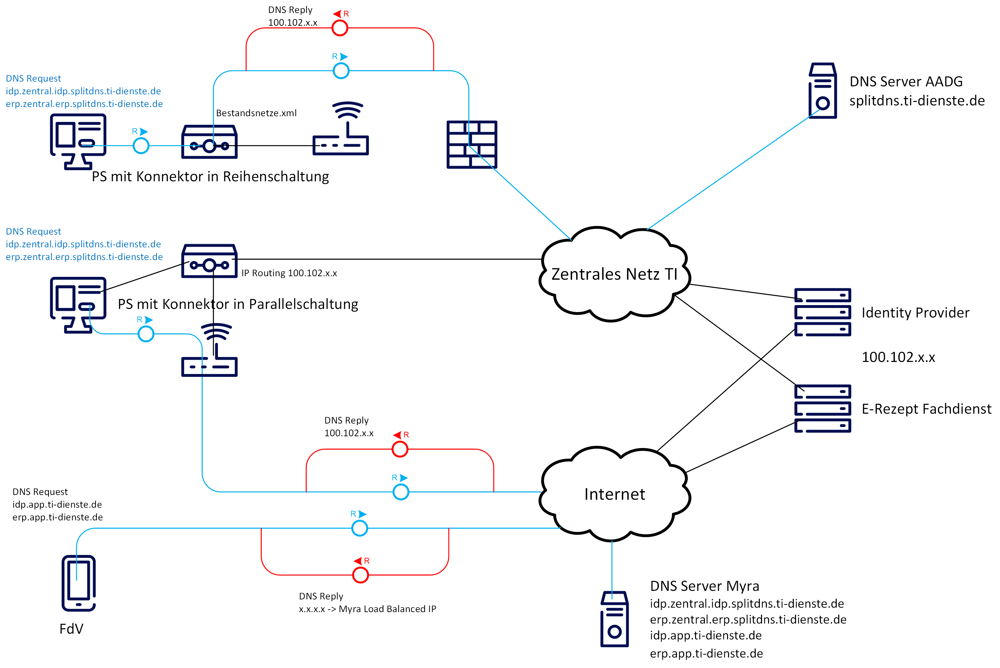

= E-Rezept API-Dokumentation TI-Konfiguration image:gematik_logo.png[width=150, float="right"]
// asciidoc settings for DE (German)
// ==================================
:imagesdir: ../images
:tip-caption: :bulb:
:note-caption: :information_source:
:important-caption: :heavy_exclamation_mark:
:caution-caption: :fire:
:warning-caption: :warning:
:toc: macro
:toclevels: 2
:toc-title: Inhaltsverzeichnis
:AVS: https://img.shields.io/badge/AVS-E30615
:PVS: https://img.shields.io/badge/PVS/KIS-C30059
:FdV: https://img.shields.io/badge/FdV-green
:eRp: https://img.shields.io/badge/eRp--FD-blue
:KTR: https://img.shields.io/badge/KTR-AE8E1C
:DEPR: https://img.shields.io/badge/DEPRECATED-B7410E
:NCPeH: https://img.shields.io/badge/NCPeH-orange

// Variables for the Examples that are to be used
:branch: 2025-10-01
:date-folder: 2025-10-01

Zielgruppe: image:{PVS}[] image:{AVS}[] image:{KTR}[]

Hier gibt die gematik eine Hilfestellung zur Konfiguration des lokalen Netzwerkes der Leistungserbringerumgebung.
Damit können Primärsysteme die Dienste der Telematikinfrastruktur über das Netzwerkrouting erreichen und
die Namensauflösung (DNS) der TI verwenden, um zu den TI-Adressen z.B. `https://erp.zentral.erp.splitdns.ti-dienste.de` die IP-Adressen der Fachdienst zu erfahren.

Primärsysteme erreichen den IDP und E-Rezept-Fachdienst über den Konnektor (IP-Adressbereich "offene Fachdienste"). In Netzwerkkonfigurationen, in denen der Konnektor nicht "in Reihe geschaltet" ist, sind die folgenden Punkte zu beachten. Den Primärsystemen (bzw. den Computern auf denen sie installiert sind - Host) muss über eine Netzwerkkonfiguration (z.B. über DHCP) ein DNS-Resolver und ein Default-Gateway für das Routing mitgeteilt werden.

IMPORTANT: Das geschlossene Netz des digitalen Gesundheitswesens nutzt IP-Adressen, die ebenso außerhalb des geschlossenen Netzes und im Internet benutzt werden können. Es ist nicht auszuschließen, dass es dabei zu Konflikten in der Adressierung von einzelnen Diensten kommen kann.

toc::[]

== Konfiguration des Routings
Der Host-Computer des Primärsystems kennt ein Default-Gateway, an das ausgehende Datenpakete für das weitere Routing in Richtung Zieladresse geschickt werden. Für Ziele in der Telematikinfrastruktur müssen diese Datenpakete zum Konnektor geschickt werden, der je nach Netzwerkkonfiguration nicht das Default-Gateway ist.

Die Lösung besteht im Einrichten einer Weiterleitung für Zieladressen in der TI, sodass Datenpakete mit einer Zieladresse für bspw. offene Fachdienste vom Default-Gateway des Netzwerkes nicht ins Internet, sondern an den Konnektor weitergeleitet werden.

[cols="a,a"]
[%autowidth]
|===
|*Ziele*       |*Adressbereiche*
|offene Fachdienste|`100.102.0.0/17` +
`100.103.0.0/16`
|aAdG und aAdG NetG-TI|`100.102.128.0/17`
2.+|*Die Routen für offene Fachdienste und aAdG + aAdG NetG-TI lassen sich zusammenfassen zu [red yellow-background]#100.102.0.0/15#, um nur eine Route konfigurieren zu müssen. +
Für die Referenzumgebung RU ist der Adressbereich mit `10.30.0.0/15` zu konfigurieren.*
|aAdG-NetG (*Bestandsnetze*)|siehe lokale Repo-Datei link:../config/Konnektor_Bestandsnetze.xml[Konnektor_Bestandsnetze.xml] (Version 2.1.6 - April 2021), +
Umzug ins gematik-git-Account demnächst geplant)
|===

NOTE: Die Weiterleitung kann Segmentweise eingerichtet werden und muss nicht für jede Zieladresse einzeln erfolgen (übergreifende Routen).

IMPORTANT: Die Liste der erreichbaren aAdG (*WANDA*) wird regelmäßig aktualisiert, wenn im Rahmen der Bestätigung neuer Anbieter Adressbereiche des Anbieters hinzukommen.

Je nach Art und Größe des lokal verwalteten Netzwerks der Leistungserbringerumgebung kommt im Gateway unterschiedliche Hard- und Software zum Einsatz. Einige lassen sich über die Kommandozeile admnistrieren, andere besitzen eine eigene API (z.B. Fritzbox, Speedport) und in bestimmten Fällen lässt sich die Konfiguration über ein UserInterface einrichten.

=== FritzBox-Konfiguration
Im Folgenden ist die Konfiguration einer Fritzbox über die grafische Benutzeroberfläche im Browser dargestellt.

image:fritzbox_1.png[width=100%]
Öffnen sie die Netzwerkeinstellungen und wählen sie für `Statische Routingtabelle` die IP-Version des lokalen Netzwerks

image:fritzbox_2.png[width=100%]
Wählen Sie das Hinzufügen einer neuen statischen Route (im Bsp. für IPv4-Routen)

image:fritzbox_3.png[width=100%]
Tragen sie bei *Netzwerk* den Adressbereich für z.B "Offene Fachdienste* wie oben angegeben ein.

IMPORTANT: Das Präfix `/16` bedeutet eine Subnetz-Maske von `255.255.0.0`, +
im Beispiel ist `10.10.10.1` die IP-Adresse des Konnektors im lokalen Netzwerk.

NOTE: Fügen Sie weitere Routen hinzu für die Bestandsnetze und aAdG.

Zusätzlich stellt AVM standardisierte link:https://avm.de/service/schnittstellen/[Schnittstellen (TR-064)] bereit, um die Netzwerkkonfiguration ggfs. auch automatisiert durchführen zu können: +
https://avm.de/fileadmin/user_upload/Global/Service/Schnittstellen/layer3forwardingSCPD.pdf

=== Konfiguration eines Linux-basierten Gateways
In größeren Netzwerken kommt mitunter eine gegenüber einer z.B. Fritzbox leistungsstärkere Hard- und Software in Form von Linux-Servern zum Einsatz. Diese lassen sich meist über die Kommandozeile administrieren.

Mit folgendem Shell-Kommando lassen sich die Routen für z.B. offene Fachdienste statisch festlegen:

`$ ip route add 100.102.0.0/15 via 10.10.10.1 dev eth0` +
seien dabei *10.10.10.1* die Konnektoradresse im lokalen Netz und *eth0* der verwendete Netzwerkinterface-Name

NOTE: Für die Persistierung der statischen Routen ist darauf zu achten, welche Distribution verwendet wird und es sind die dazugehörigen Konfigurationen vorzunehmen. +
Andernfalls ist diese Netzwerkkonfiguration nach jedem Neustart zu tätigen. +
- Bspw. CentOS erlaubt das Erstellen von Skripten für die Netzwerkkonfiguration +
- Bspw. Ubuntu nutzt netplan, wo die Netzwerkkonfiguration in einer Netplan-Datei erfolgt

== Konfiguration der DNS-Namensauflösung
Über die Namensauflösung werden FQDNs (z.B. `erp.zentral.erp.splitdns.ti-dienste.de` für den E-Rezept-Fachdienst) in IP-Adressen für das Routing übersetzt. Werden bpw. für die Lastverteilung oder zur Ausfallsicherheit mehrere Serverknoten eingesetzt, liefert die Namensauflösung für einen FQDN mehrere IP-Adressen zurück. Die folgende Abbildung zeigt eine Übersicht der verwendeten Namensdienste.

In Netzwerken, in denen der Konnektor in Reihe geschaltet ist, kann dieser Ziel-Adressen in der TI über ein DNS-Forward vom Namensdienst der TI auflösen lassen. Für Zieladressen außerhalb der TI nutzt der Konnektor die Namensdienste im Internet.

In lokalen Netzwerken mit Parallelschaltung des Konnektors nutzen die Clients denjenigen DNS-Server, der ihnen im Rahmen der Netzwerkkonfiguration zugewiesen wird.
Für das E-Rezept müssen die folgenden beiden FQDNs in IP-Adressen aufgelöst werden können:

IMPORTANT: `erp.zentral.erp.splitdns.ti-dienste.de` für den E-Rezept-Fachdienst +
`idp.zentral.idp.splitdns.ti-dienste.de` für den IdentityProvider (IDP)

NOTE: Weitere Telematikadressen werden unter anderem unter der Domains `*.telematik` geführt. +
Die Adresse des Apothekenverzeichnisses apovzd.zentral.erp.splitdns.ti-dienste.de wird von den Primärsystemen nicht genutzt.

=== Konnektor für Namensauflösung im lokalen Netz
Eine Variante der direkten Namensauflösung für Adressen der Telematikinfrastruktur ist, den Konnektor als primären DNS-Server über die Netzwerkkonfiguration durch den DHCP-Server in den Clients festzulegen. FQDNs der TI werden dann vom Konnektor durch den Namensdienst der TI aufgelöst, alle übrigen Adressen löst der Konnektor durch einen Namensdienst im Internet auf. Diese Funktionsweise stellt sich wie eine Reihenschaltung dar, nur dass der Konnektor nicht das Default-Gateway der Clients ist.

=== Anderer DNS-Resolver im lokalen Netz
Die Alternative dazu nutzt den Konnektor für die Namensauflösung nicht direkt. In Netzwerken mit eigenem Domain Controller lässt sich ein domain-spezifischer Forwarder konfigurieren, mit dem die Adressen `splitdns.ti-dienste.de` und die Adressen mit `*.telematik` über den Konnektor in IP-Adressen der TI aufgelöst werden können.

=== Fehlerbehandlung der DNS Konfiguration
In Netzwerken, in denen stärkere Gateway Hard- und Software zum Einsatz kommt, kann es sein, dass die Funktion der _"DNS rebinding protection"_ aktiviert ist. Die DNS rebinding protection ist im Wesentlichen als Sicherheitsfeature anzusehen und soll verhindern, dass im Internet aufgelöste FQDNs in private/lokale IP-Adressen (zB. für einen Phishing Server im lokalen Netz) übersetzt werden dürfen. Einige Dienste sind jedoch darauf ausgelegt, dass die Auflösung der FQDNs auch private/lokale IP-Adressen zurückgeben darf, so wie im Fall des E-Rezepts. Die IP-Adressen hierfür stammen aus dem _"shared address space"_.

Ein Beispiel für eine Gateway Software, die diese Funktion standardmäßig aktiviert hat, ist die Open-source Lösung OPNsense. Sie basiert auf BSD und nutzt als DNS Dienst die Software Unbound.

==== Diagnose
Eine einfach DNS Abfrage kann mögliche Probleme bei der Namensauflösung aufzeigen.
Öffnen Sie hierfür ein Terminal unter Windows und geben Sie folgende Zeile ein: `nslookup erp.zentral.erp.splitdns.ti-dienste.de`

Erhalten Sie folgende Antwort, kann dies auf eine aktivierte _"DNS rebinding protection"_ zurückzuführen sein.
....
>nslookup erp.zentral.erp.splitdns.ti-dienste.de
Server:  OPNsense.home
Address:  192.168.1.1

*** Keine internal type for both IPv4 and IPv6 Addresses (A+AAAA)-Einträge für erp.zentral.erp.splitdns.ti-dienste.de verfügbar.
....

==== Lösung der Problematik
Eine Ausnahme für die Auflösung der Adressen `splitdns.ti-dienste.de` und `*.telematik` für den Fachdienst des E-Rezepts müssen in den DNS Einstellungen des DNS Servers eingetragen werden.

===== OPNsense-Konfiguration
Im Falle einer OPNsense Firewall ist dies im Web Interface in wenigen Schritten getan. Öffnen Sie das Web Interface und klicken Sie auf der linken Seite auf [Dienste], weiter auf [Unbound DNS] und dort auf [Erweitert].
Suchen Sie hier den Punkt [private Domains], tragen Sie dort die Adresse `splitdns.ti-dienste.de` ein und bestätigen Sie die Eingabe mit Enter. Führen Sie dies genauso mit der `*.telematik` Adresse durch.
Wenn Sie dies abgeschlossen haben, scrollen Sie an das Ende der Seite und klicken Sie [Anwenden]. Der Dienst übernimmt nun die Einstellungen.

==== Kontrolle
Eine erneute DNS Abfrage sollte nun die aufgelösten Adressen zurückgeben:

....
>nslookup erp.zentral.erp.splitdns.ti-dienste.de
Server:  OPNsense.home
Address:  192.168.1.1

Nicht autorisierende Antwort:
Name:    erp.zentral.erp.splitdns.ti-dienste.de
Addresses:  100.102.28.10
          100.102.29.10
....

== Konfiguration der TI Zertifikatsstämme (CA)

Um in der Kommunikation mit dem Konnektor Zertifikate erfolgreich validieren zu können ist es wichtig sicher zu stellen, dass `konnektor.konlan` auf die IP des Konnektors auflöst.

Zusätzlich müssen die entprechenden CAs der genutzten Umgebung auf dem System installiert sein/als vertrauenswürdig angesehen werden. Die entsprechenden Zertifikate sind hier erhältlich:

* PU: https://download.tsl.ti-dienste.de
* RU: https://download-ref.tsl.ti-dienste.de/
* TU: https://download-test.tsl.ti-dienste.de/

Hier werden aktuell folgende Zertifikate benötigt:

RSA:

* `ROOT-CA` -> `GEM.RCA6_TEST-ONLY.der`
* `SUB-CA` -> `GEM.KOMP-CA54_TEST-ONLY.der`

ECC:

* `ROOT-CA` -> `GEM.RCA4_TEST-ONLY.der`
* `SUB-CA` -> `GEM.KOMP-CA50_TEST-ONLY.der`

== Fehlerbehandlung Konnektor

In besonderen Konstellationen kann es zu Fehlern im Verbindungsaufbau der TI kommen. Folgende Probleme und Workarounds wurden derzeit identifiziert und definiert.

=== Verwendung SMC-B G2 mit secunet Konnektor

==== Problemstellung
Der secunet Konnektor bietet Funktionalitäten an, welche die Migration von RSA zu ECC vorbereiten. Es ist zu beachten, dass Smartcards der Generation G2 (bspw. SMC-B) noch keine ECC Zertifikate beinhalten und somit kein ECC unterstützen können und somit der TLS-Verbindungsaufbau (bspw. zwischen Fachmodul VSDM und Intermediär VSDM) auf Basis ECC nicht funktioniert.

==== Lösung
Es ist bei der Verwendung von Smartcards G2 darauf zu achten, dass im Setting des secunet Konnektors für TLS die Verwendung von ECC-Ciphersuiten deaktiviert ist.

image:SMC-B_ECC_secunet_setting.png[width=100%]

=== Fehlerhafter VSDM Aufruf mit PN3

==== Problemstellung
Der VSDM++-Abruf für das Feature „eGK in der Apotheke“ führt in einigen Fällen zu einem Timeout. Dies äußert sich dadurch, dass der Abrufå etwa 25 Sekunden dauert und mit einem Prüfnachweis mit dem Code „3“ quittiert wird.

Dies betrifft nachweislich AVS-Systeme mit einem secunet-Konnektor. Andere Konfigurationen mit einem RISE- oder KoCo-Konnektor können ebenso von einer signifikanten Anzahl an Prüfnachweisen mit dem Code „3“ betroffen sein.

==== Lösung
Die Konnektor-Einstellung "nonQES-Authentifizierungstimeout" wird von 3 Sekunden auf 6 Sekunden erhöht. Das führt dazu, dass der Timeout für OCSP-Abfragen erhöht wird. Hierbei reduziert sich die Fehlerrate signifikant. Es ist darauf zu achten, dass dies nur von AVS zu implementieren ist, wenn die Operation ReadVSD() asynchon umgesetzt wird, da es sonst zu Seiteneffekten kommen kann.

Möglicherweise sind durch diese Einstellung auch andere TI-Anwendungen betroffen, bspw. KIM, VZD.

image:secunet-ocsp-timeout.png[width=100%]
