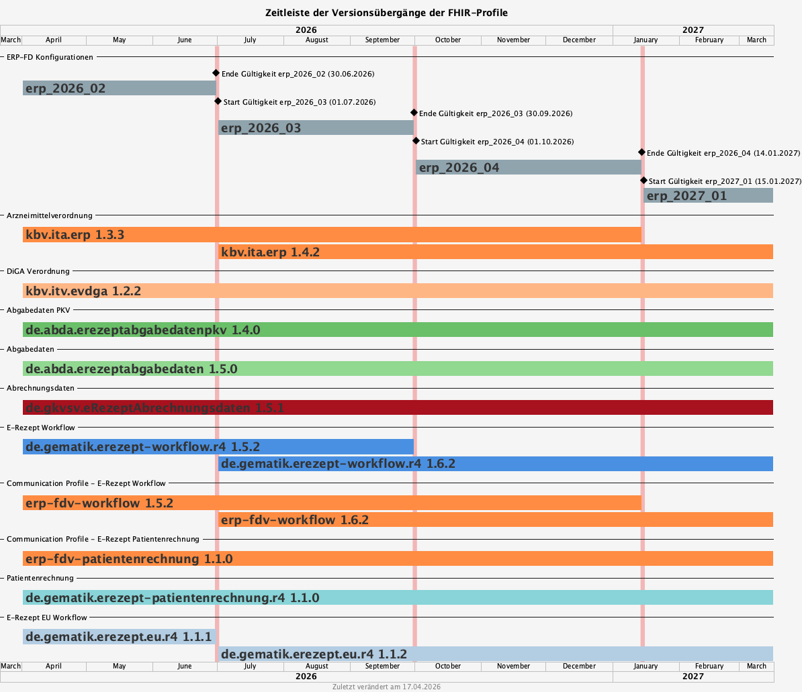

= E-Rezept FHIR Veränderungen für 01.07.2026 image:gematik_logo.png[width=150, float="right"]
include::./config-source.adoc[]

toc::[]

Der Übergang ab 01.07.2026 im E-Rezept ermöglichen:

* Die Verordnung von E-T-Rezepten
* Die Angabe strukturierter Dosierungen bei Verordnung und Abgabe von Arzneimitteln

== Versionsübergabegänge

Der anstehende FHIR-Profilübergang stellt sich wie folgt dar:

Die zugrundeliegende Konfiguration findet sich hier: link:../resources/configuration/2026-07-01_fhir-transition.json[Konfiguration für den Übergang zum 01.07.2026]

=== Package Gültigkeiten

Die Gültigkeiten von FHIR Packages in diesem Übergang stellen sich wie folgt dar:

include::../resources/scripts/output_adoc/2026-07-01_fhir-transition/transition-overview.adoc[]

Hinweis: Die Daten für "in PU einstellbar bis" sind in xref:../docs/erp_deprecated_package_fd.adoc[E-Rezept FHIR-Package Nachhaltung] beschrieben.

Die Profile für die Angaben _erp-fdv-workflow_ und _erp-fdv-patientenrechnung_ entsprechen den Communication Profilen aus den Packages:
[options="header"]
|===
| Profilname | aus Package | Bestandteil von
| GEM_ERP_PR_Communication_Representative | de.gematik.erezept-workflow.r4 | erp-fdv-workflow
| GEM_ERP_PR_Communication_DispReq | de.gematik.erezept-workflow.r4 | erp-fdv-workflow
| GEM_ERPCHRG_PR_PAR_Patch_ChargeItem_Input | de.gematik.erezept-patientenrechnung.r4 | erp-fdv-patientenrechnung
| GEM_ERPCHRG_PR_Communication_ChargChangeReq | de.gematik.erezept-patientenrechnung.r4 | erp-fdv-patientenrechnung
| GEM_ERPCHRG_PR_Consent | de.gematik.erezept-patientenrechnung.r4 | erp-fdv-patientenrechnung
|===

== Änderungen

=== Übersicht
[cols="a,a,a,a"]
[%autowidth]
|===
h|Betrifft h|Feature h|Ressource h|Änderungen

| *Alle* | *Allgemein* | Alle | Anpassen der Versionsangabe in meta.profile von '\|1.Y' zu '\|1.X'.

In allen Ressourcen wird die Versionsangabe in meta.profile angepasst. Bsp: '\|1.4' statt '\|1.3'

| image:{PVS}[] | *Verordnung* | link:https://simplifier.net/erezept/kbv_pr_erp_bundle[KBV_PR_ERP_Bundle] | 
Mit den neuen eRezept Profilen ist es möglich, dass E-T-Rezepte verordnet werden können. Der E-Rezept-Fachdienst validiert die neuen Profile und ermöglicht das Einstellen von Verordnungen mit Flowtype 166.

Hinweis: Die Profile der KBV ermöglichen theoretisch das Erstellen einer E-Btm-Verordnung. Der E-Rezept-Fachdienst würde diese aber ablehnen.

| image:{PVS}[] image:{AVS}[] | *Verordnung, Abgabe* | link:https://simplifier.net/erezept/kbv_pr_erp_bundle[KBV_PR_ERP_Bundle], link:https://simplifier.net/erezept-workflow/gem_erp_pr_par_closeoperation_input[GEM_ERP_PR_PAR_CloseOperation_Input] | 
Die Profile des KBV eRezepts und gematik Workflow erlauben die strukturierte Angabe von Dosierinformationen nach link:https://ig.fhir.de/igs/medication/[Medication IG DE] der HL7 DE.
Für die korrekte Erstellung von strukturierten Dosierungen muss der FHIR IG der HL7 implementiert werden.

Wichtig: der E-Rezept-Fachdienst validiert den erzeugten Dosiertext nach link:https://ig.fhir.de/igs/medication/dosierung-textgenerierung.html[Dosis Textgenerierung]. Verordnende und Abgebende Systeme müssen eine Implementierung erstellen, die einen Text mit gleichem Output wie die link:https://github.com/hl7germany/dgMP-DosageTextgenerierung-Skript[Python Referenzimplementierung] erzeugen.

|===

=== Release Notes der FHIR Packages
Weiterhin sind die Releasenotes der FHIR-Packages zu beachten:

[cols="a,a,a"]
[%autowidth]
|===
h| Herausgeber h|FHIR Package h| Beispiele
| gematik |  link:https://simplifier.net/packages/de.gematik.erezept-workflow.r4/1.6.0[de.gematik.erezept-workflow.r4 Package 1.6.0^]  | link:https://github.com/gematik/eRezept-Examples/tree/main/Standalone-Examples/de.gematik.erezept-workflow.r4/1.6.0[Beispiele 1.6.0^]
| KBV |  link:https://simplifier.net/packages/kbv.ita.erp/1.4.0[kbv.ita.erp Package 1.4.0^] | link:https://github.com/gematik/eRezept-Examples/tree/main/Standalone-Examples/kbv.ita.erp/1.4.0[Beispiele 1.4.0]
|===

